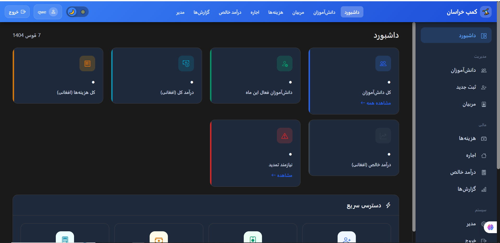

# 🏟️ Khorasan Club - Sports Camp Management System

A comprehensive management system for sports camps with offline capabilities, full Jalali (Shamsi) calendar support, and RTL interface for Dari language.


**Repository:** https://github.com/Ahmadullah-github/khorasan_clup

---

## 📋 Table of Contents

- [Features](#-features)
- [Screenshots](#-screenshots)
- [Technology Stack](#-technology-stack)
- [Installation](#-installation)
  - [Option 1: Docker Installation](#option-1-docker-installation-recommended)
  - [Option 2: XAMPP Installation](#option-2-xampp-installation-windows)
- [Default Login Credentials](#-default-login-credentials)
- [Project Structure](#-project-structure)
- [Database Schema](#-database-schema)
- [API Documentation](#-api-documentation)
- [Coach Payment Algorithm](#-coach-payment-algorithm)
- [Offline Support](#-offline-support)
- [Security Features](#-security-features)
- [Jalali Calendar](#-jalali-calendar)
- [Troubleshooting](#-troubleshooting)
- [Contributing](#-contributing)
- [License](#-license)

---

## ✨ Features

### Core Functionality
- ✅ **Student Management** - Registration, renewal, photo uploads
- ✅ **Coach Management** - Time slot assignments, contract management (percentage/salary/hybrid)
- ✅ **Financial Tracking** - Income, expenses, rent management
- ✅ **Invoice Generation** - PDF invoices with WhatsApp sharing
- ✅ **Reports** - Monthly reports, activity reports, CSV export
- ✅ **Dashboard** - KPIs: total students, active this month, income, expenses, net income

### Technical Features
- ✅ **Offline Support** - Works without internet using IndexedDB
- ✅ **Jalali Calendar** - Full Persian/Dari date support (Hamal to Hoot)
- ✅ **RTL Interface** - Right-to-left layout for Dari language
- ✅ **Dark/Light Mode** - Persistent theme settings
- ✅ **Responsive Design** - Mobile to desktop support
- ✅ **Audit Logging** - Complete activity tracking with IP addresses

### Security
- ✅ **Secure Authentication** - BCRYPT password hashing
- ✅ **Account Lockout** - 5 failed attempts = 15-minute lockout
- ✅ **CSRF Protection** - Token-based form protection
- ✅ **SQL Injection Prevention** - PDO prepared statements
- ✅ **Session Timeout** - 30-minute auto-logout

---

## 🖼️ Screenshots



---

## 🛠️ Technology Stack

| Layer | Technology |
|-------|------------|
| **Backend** | PHP 7.4+ (PHP 8+ recommended) |
| **Database** | MySQL 8.0 with utf8mb4 encoding |
| **Frontend** | Vanilla JavaScript (ES6+), HTML5, CSS3 |
| **UI Framework** | Bootstrap 5.3+ |
| **Date Picker** | Persian Datepicker for Jalali dates |
| **Offline Storage** | IndexedDB |

---

## 🚀 Installation

Choose one of the following installation methods. Both methods will get you a fully working system.

---

### Option 1: Docker Installation (Recommended)

Docker provides a consistent environment across all operating systems (Windows, macOS, Linux).

#### Prerequisites

Before starting, make sure you have these installed:

1. **Docker Desktop**
   - Download from: https://www.docker.com/products/docker-desktop/
   - Windows: Run the installer and restart your computer
   - macOS: Drag to Applications folder
   - Linux: Follow instructions at https://docs.docker.com/engine/install/

2. **Git** (optional, for cloning)
   - Download from: https://git-scm.com/downloads

#### Step-by-Step Installation Guide

##### Step 1: Clone the Repository

Open your terminal (Command Prompt, PowerShell, or Terminal) and run:

```bash
git clone https://github.com/Ahmadullah-github/khorasan_clup.git
cd khorasan_clup
```

**Alternative:** Download ZIP from GitHub and extract it.

##### Step 2: Create Docker Compose File

Create a new file named `docker-compose.yml` in the project root folder with this content:

```yaml
version: '3.8'

services:
  # PHP + Apache Web Server
  web:
    image: php:8.2-apache
    container_name: khorasan_web
    ports:
      - "8080:80"
    volumes:
      - ./public:/var/www/html
      - ./api:/var/www/html/api
    depends_on:
      db:
        condition: service_healthy
    environment:
      - DB_HOST=db
      - DB_NAME=khorasan_club
      - DB_USER=root
      - DB_PASS=rootpassword
    command: >
      bash -c "docker-php-ext-install pdo pdo_mysql mysqli &&
               a2enmod rewrite &&
               apache2-foreground"
    restart: unless-stopped

  # MySQL Database
  db:
    image: mysql:8.0
    container_name: khorasan_db
    restart: unless-stopped
    environment:
      MYSQL_ROOT_PASSWORD: rootpassword
      MYSQL_DATABASE: khorasan_club
      MYSQL_CHARACTER_SET_SERVER: utf8mb4
      MYSQL_COLLATION_SERVER: utf8mb4_unicode_ci
    ports:
      - "3307:3306"
    volumes:
      - mysql_data:/var/lib/mysql
      - ./database/full_schema.sql:/docker-entrypoint-initdb.d/01-schema.sql
    healthcheck:
      test: ["CMD", "mysqladmin", "ping", "-h", "localhost"]
      timeout: 20s
      retries: 10

  # phpMyAdmin (Database Management UI)
  phpmyadmin:
    image: phpmyadmin/phpmyadmin
    container_name: khorasan_phpmyadmin
    restart: unless-stopped
    ports:
      - "8081:80"
    environment:
      PMA_HOST: db
      PMA_USER: root
      PMA_PASSWORD: rootpassword
    depends_on:
      - db

volumes:
  mysql_data:
```

##### Step 3: Update Database Configuration for Docker

Edit `api/config.php` and update the database settings to use environment variables:

```php
// Find these lines and update them:
define('DB_HOST', getenv('DB_HOST') ?: 'localhost');
define('DB_NAME', getenv('DB_NAME') ?: 'khorasan_club');
define('DB_USER', getenv('DB_USER') ?: 'root');
define('DB_PASS', getenv('DB_PASS') !== false ? getenv('DB_PASS') : '');
```

> **Note:** The current config.php already supports environment variables, so this step may already be done.

##### Step 4: Start Docker Containers

Open terminal in the project folder and run:

```bash
docker-compose up -d
```

This command will:
- Download required Docker images (first time only, ~500MB)
- Create and start all containers
- Import the database schema automatically

**Wait 30-60 seconds** for MySQL to fully initialize.

##### Step 5: Verify Installation

Check if all containers are running:

```bash
docker-compose ps
```

You should see all three containers with "Up" status:
```
NAME                 STATUS
khorasan_web         Up
khorasan_db          Up (healthy)
khorasan_phpmyadmin  Up
```

##### Step 6: Access the Application

Open your browser and navigate to:

| Service | URL | Description |
|---------|-----|-------------|
| **Application** | http://localhost:8080 | Main application |
| **phpMyAdmin** | http://localhost:8081 | Database management |

##### Step 7: Login

Use the default credentials:
- **Username:** `admin`
- **Password:** `admin123`

🎉 **Congratulations! Your application is now running!**

#### Docker Commands Reference

```bash
# Start containers (in background)
docker-compose up -d

# Stop containers
docker-compose down

# View container logs
docker-compose logs -f

# View specific container logs
docker-compose logs -f web

# Restart all containers
docker-compose restart

# Rebuild containers (after config changes)
docker-compose up -d --build

# Stop and remove everything (WARNING: deletes database data!)
docker-compose down -v

# Check container status
docker-compose ps

# Access MySQL shell
docker exec -it khorasan_db mysql -u root -prootpassword khorasan_club

# Access web container shell
docker exec -it khorasan_web bash
```

#### Docker Troubleshooting

| Problem | Solution |
|---------|----------|
| Port 8080 already in use | Change `8080:80` to `8082:80` in docker-compose.yml |
| Port 3307 already in use | Change `3307:3306` to `3308:3306` in docker-compose.yml |
| Database connection error | Wait 60 seconds and refresh, or run `docker-compose restart` |
| Containers won't start | Run `docker-compose down -v` then `docker-compose up -d` |
| Permission denied errors | On Linux, run `sudo chmod -R 755 public/assets/` |

---

### Option 2: XAMPP Installation (Windows)

XAMPP is the easiest way to run this project on Windows without Docker.

#### Prerequisites

1. **XAMPP**
   - Download from: https://www.apachefriends.org/download.html
   - Choose the PHP 8.x version (recommended)
   
2. **Git** (optional)
   - Download from: https://git-scm.com/downloads

#### Step-by-Step Installation Guide

##### Step 1: Install XAMPP

1. Run the XAMPP installer
2. Choose installation directory (default: `C:\xampp` or `E:\xampp`)
3. Select components to install:
   - ✅ Apache
   - ✅ MySQL
   - ✅ PHP
   - ✅ phpMyAdmin
4. Complete the installation
5. **Important:** If Windows Firewall asks, click "Allow access"

##### Step 2: Download the Project

**Option A - Using Git:**

Open Command Prompt and run:
```cmd
cd C:\xampp\htdocs
git clone https://github.com/Ahmadullah-github/khorasan_clup.git sports-camp
```

**Option B - Manual Download:**

1. Go to https://github.com/Ahmadullah-github/khorasan_clup
2. Click the green "Code" button
3. Click "Download ZIP"
4. Extract the ZIP file
5. Rename the extracted folder to `sports-camp`
6. Move it to `C:\xampp\htdocs\sports-camp`

Your folder structure should look like this:
```
C:\xampp\htdocs\sports-camp\
├── api\
│   ├── config.php
│   ├── auth.php
│   └── ...
├── public\
│   ├── index.html
│   ├── login.html
│   └── ...
├── database\
│   └── full_schema.sql
├── migrations\
└── README.md
```

##### Step 3: Start XAMPP Services

1. Open **XAMPP Control Panel** (run as Administrator for best results)
2. Click **Start** next to **Apache**
3. Click **Start** next to **MySQL**
4. Both should show green "Running" status


> **Tip:** If Apache won't start, port 80 might be in use. Click "Config" → "Apache (httpd.conf)" and change `Listen 80` to `Listen 8080`.

##### Step 4: Create the Database

1. Open your browser
2. Go to: http://localhost/phpmyadmin
3. Click **"New"** in the left sidebar
4. Enter database name: `khorasan_club`
5. Select collation: `utf8mb4_unicode_ci`
6. Click **"Create"**

##### Step 5: Import Database Schema

1. In phpMyAdmin, click on `khorasan_club` database (left sidebar)
2. Click the **"Import"** tab (top menu)
3. Click **"Choose File"** button
4. Navigate to: `C:\xampp\htdocs\sports-camp\database\full_schema.sql`
5. Click **"Open"**
6. Scroll down and click **"Go"**
7. Wait for "Import has been successfully finished" message

> **Note:** The schema file automatically creates the admin user, so you don't need to create it manually.

##### Step 6: Verify Database Configuration

Open `C:\xampp\htdocs\sports-camp\api\config.php` and verify these settings:

```php
define('DB_HOST', 'localhost');
define('DB_NAME', 'khorasan_club');
define('DB_USER', 'root');
define('DB_PASS', '');  // Empty password is default for XAMPP
```

> **Note:** XAMPP uses `root` with no password by default. Don't change this unless you've set a MySQL password.

##### Step 7: Set Folder Permissions

Make sure these folders exist and are writable:
- `public/assets/uploads/`
- `public/assets/invoices/`

On Windows, these should work automatically. If you get upload errors:
1. Right-click the folder
2. Click "Properties"
3. Go to "Security" tab
4. Click "Edit"
5. Select "Users"
6. Check "Full control"
7. Click "OK"

##### Step 8: Access the Application

Open your browser and go to:

```
http://localhost/sports-camp/public/
```

##### Step 9: Login

Use the default credentials:
- **Username:** `admin`
- **Password:** `admin123`

🎉 **Congratulations! Your application is now running!**

---

#### Optional: Configure Virtual Host (Clean URL)

For a cleaner URL like `http://sports-camp.local/` instead of `http://localhost/sports-camp/public/`:

##### Step A: Edit Apache Virtual Hosts Configuration

1. Open Notepad **as Administrator**
2. Open file: `C:\xampp\apache\conf\extra\httpd-vhosts.conf`
3. Add this at the end of the file:

```apache
<VirtualHost *:80>
    ServerName sports-camp.local
    DocumentRoot "C:/xampp/htdocs/sports-camp/public"

    <Directory "C:/xampp/htdocs/sports-camp/public">
        AllowOverride All
        Require all granted
        Options Indexes FollowSymLinks
    </Directory>

    Alias /api "C:/xampp/htdocs/sports-camp/api"
    <Directory "C:/xampp/htdocs/sports-camp/api">
        AllowOverride None
        Require all granted
    </Directory>

    ErrorLog "logs/sports-camp-error.log"
    CustomLog "logs/sports-camp-access.log" combined
</VirtualHost>
```

> **Note:** Adjust paths if your XAMPP is installed in a different location (e.g., `E:/xampp/`).

##### Step B: Edit Windows Hosts File

1. Open Notepad **as Administrator**
2. Open file: `C:\Windows\System32\drivers\etc\hosts`
3. Add this line at the end:

```
127.0.0.1    sports-camp.local
```

4. Save the file

##### Step C: Restart Apache

1. Open XAMPP Control Panel
2. Click **Stop** next to Apache
3. Click **Start** next to Apache

##### Step D: Access via Clean URL

Open your browser and go to:

```
http://sports-camp.local/
```

---

## 🔐 Default Login Credentials

| Username | Password | Role |
|----------|----------|------|
| `admin` | `admin123` | Administrator |

⚠️ **IMPORTANT:** Change the default password immediately after first login!

To change password:
1. Login as admin
2. Go to Admin page
3. Edit the admin user
4. Set a new secure password

---

## 📁 Project Structure

```
khorasan_clup/
├── api/                        # Backend PHP API
│   ├── config.php             # Database & session configuration
│   ├── utils.php              # Helper functions (Jalali dates, validation)
│   ├── index.php              # API router/dispatcher
│   ├── auth.php               # Authentication endpoints
│   ├── students.php           # Student CRUD operations
│   ├── coaches.php            # Coach management
│   ├── expenses.php           # Expense tracking
│   ├── rent.php               # Rent management
│   ├── accounting.php         # Financial calculations
│   ├── reports.php            # Report generation
│   ├── invoices.php           # Invoice management
│   ├── sync.php               # Offline sync operations
│   ├── audit.php              # Audit log queries
│   └── upload.php             # File upload handling
│
├── public/                     # Frontend (Document Root)
│   ├── index.html             # Dashboard
│   ├── login.html             # Login page
│   ├── students.html          # Student management
│   ├── student-detail.html    # Student details
│   ├── coaches.html           # Coach management
│   ├── coach-detail.html      # Coach details
│   ├── coach-form.html        # Coach add/edit form
│   ├── expenses.html          # Expense management
│   ├── expense-detail.html    # Expense details
│   ├── rent.html              # Rent history
│   ├── accounting.html        # Net income & payments
│   ├── breakdown.html         # Financial breakdown
│   ├── reports.html           # Reports page
│   ├── invoice.html           # Invoice generation
│   ├── admin.html             # User management (admin only)
│   ├── css/
│   │   └── custom.css         # RTL styles, dark mode
│   ├── js/
│   │   ├── app.js             # Main application logic
│   │   ├── jalali.js          # Jalali date functions
│   │   └── offline.js         # IndexedDB operations
│   └── assets/
│       ├── uploads/           # User uploads (photos)
│       └── invoices/          # Generated invoices
│
├── database/
│   └── full_schema.sql        # Complete database schema
│
├── migrations/                 # Database migrations
│   ├── schema.sql             # Base schema
│   ├── add_fee_calculation_slots.sql
│   ├── coaches_contract_update.sql
│   └── xampp_database_setup.sql
│
├── tests/                      # Test files
│
├── .kiro/                      # Kiro IDE configuration
│
├── apache-vhost-example.conf   # Apache VirtualHost template
├── docker-compose.yml          # Docker configuration (create this)
├── Project.md                  # Project documentation (Dari)
└── README.md                   # This file
```

---

## 🗄️ Database Schema

The system uses MySQL with the following main tables:

| Table | Description |
|-------|-------------|
| `users` | User accounts and authentication |
| `students` | Student records with contact info |
| `coaches` | Coach records with contract details |
| `time_slots` | Class time definitions (صبح، چاشت، عصر) |
| `coach_time_slot` | Many-to-many coach-timeslot relationship |
| `registrations` | Student enrollments linking students, coaches, time slots |
| `payments` | Payment records for registrations |
| `expenses` | All expenses including rent |
| `rents` | Rent-specific records (linked to expenses) |
| `invoices` | Generated invoices |
| `audit_logs` | Complete audit trail |
| `coach_contract_history` | Historical contract changes |

### Entity Relationship

```
Students ──┬── Registrations ──┬── Coaches
           │                   │
           │                   └── Time Slots
           │
           └── Payments

Expenses ──── Rents

Users ──── Audit Logs
```

---

## 📡 API Documentation

### Base URL

- **XAMPP:** `http://localhost/sports-camp/api/`
- **Docker:** `http://localhost:8080/api/`

### Authentication

All endpoints (except login) require authentication via session cookies.

### Available Endpoints

| Method | Endpoint | Description |
|--------|----------|-------------|
| **Authentication** | | |
| POST | `/auth.php?action=login` | User login |
| POST | `/auth.php?action=logout` | User logout |
| GET | `/auth.php?action=check` | Check auth status |
| **Students** | | |
| GET | `/students.php?action=list` | List all students |
| POST | `/students.php?action=create` | Create student |
| GET | `/students.php?action=get&id={id}` | Get student details |
| PUT | `/students.php?action=update&id={id}` | Update student |
| DELETE | `/students.php?action=delete&id={id}` | Delete student |
| **Coaches** | | |
| GET | `/coaches.php?action=list` | List all coaches |
| POST | `/coaches.php?action=create` | Create coach |
| GET | `/coaches.php?action=get&id={id}` | Get coach details |
| PUT | `/coaches.php?action=update&id={id}` | Update coach |
| DELETE | `/coaches.php?action=delete&id={id}` | Delete coach |
| **Expenses** | | |
| GET | `/expenses.php?action=list` | List expenses |
| POST | `/expenses.php?action=create` | Create expense |
| GET | `/expenses.php?action=get&id={id}` | Get expense details |
| **Rent** | | |
| GET | `/rent.php?action=list` | List rent payments |
| POST | `/rent.php?action=create` | Create rent payment |
| **Accounting** | | |
| GET | `/accounting.php?action=summary` | Get financial summary |
| GET | `/accounting.php?action=coach-payments` | Get coach payment calculations |
| **Reports** | | |
| GET | `/reports.php?action=monthly` | Monthly report |
| GET | `/reports.php?action=activity` | Activity report |
| **Invoices** | | |
| GET | `/invoices.php?action=list` | List invoices |
| POST | `/invoices.php?action=generate` | Generate invoice |

### Example API Request

```javascript
// Login
fetch('/api/auth.php?action=login', {
    method: 'POST',
    headers: { 'Content-Type': 'application/json' },
    body: JSON.stringify({
        username: 'admin',
        password: 'admin123'
    })
})
.then(response => response.json())
.then(data => console.log(data));
```

---

## 📴 Offline Support

The system works without internet using IndexedDB for local storage.

### How It Works

1. **Reading Data:** First checks IndexedDB, then fetches from API
2. **Writing Data:** Saves to IndexedDB + adds to sync queue
3. **Syncing:** When online, queued changes are sent to server

### Supported Offline Operations

- ✅ View student list
- ✅ View coach list
- ✅ Add new records (queued for sync)
- ✅ View cached reports

---

## 🔒 Security Features

| Feature | Description |
|---------|-------------|
| **Password Hashing** | BCRYPT algorithm with salt |
| **SQL Injection Prevention** | PDO prepared statements |
| **CSRF Protection** | Token-based form validation |
| **Session Timeout** | Auto-logout after 30 minutes |
| **Account Lockout** | 5 failed attempts = 15-minute lockout |
| **Audit Logging** | All changes tracked with IP addresses |
| **Input Sanitization** | Custom Sanitizer class |

---

## 📅 Jalali Calendar

All dates in the system use the Jalali (Shamsi) calendar with Dari month names:

| Month # | Dari Name | English |
|---------|-----------|---------|
| 1 | حمل | Hamal |
| 2 | ثور | Saur |
| 3 | جوزا | Jawza |
| 4 | سرطان | Saratan |
| 5 | اسد | Asad |
| 6 | سنبله | Sonbola |
| 7 | میزان | Mizan |
| 8 | عقرب | Aqrab |
| 9 | قوس | Qaws |
| 10 | جدی | Jadi |
| 11 | دلو | Dalv |
| 12 | حوت | Hoot |

**Storage Format:** `YYYY-MM-DD` (e.g., `1404-09-08`)
**Display Format:** `DD Month YYYY` (e.g., `08 قوس 1404`)

---

## 🔧 Troubleshooting

### Common Issues

#### "Database connection failed"

**XAMPP:**
1. Make sure MySQL is running in XAMPP Control Panel
2. Check `api/config.php` has correct credentials
3. Verify database `khorasan_club` exists in phpMyAdmin

**Docker:**
1. Wait 60 seconds for MySQL to initialize
2. Run `docker-compose logs db` to check for errors
3. Try `docker-compose restart`

#### "Page not found" or 404 Error

**XAMPP:**
- Make sure you're accessing `http://localhost/sports-camp/public/` (note the `/public/` at the end)
- Check that files are in `C:\xampp\htdocs\sports-camp\`

**Docker:**
- Access `http://localhost:8080` (not 8080/public)

#### "White/blank page"

1. Check PHP error logs:
   - XAMPP: `C:\xampp\apache\logs\error.log`
   - Docker: `docker-compose logs web`
2. Enable error display temporarily in `api/config.php`:
   ```php
   ini_set('display_errors', 1);
   ```

#### "Upload failed" or "Permission denied"

**XAMPP (Windows):**
1. Right-click `public/assets/uploads` folder
2. Properties → Security → Edit
3. Allow "Full control" for Users

**Docker/Linux:**
```bash
chmod -R 755 public/assets/
```

#### "CSRF token mismatch"

1. Clear browser cookies
2. Logout and login again
3. Make sure you're not using multiple tabs

### Getting Help

If you still have issues:
1. Check the error logs
2. Create an issue on GitHub: https://github.com/Ahmadullah-github/khorasan_clup/issues
3. Include: error message, steps to reproduce, your environment (XAMPP/Docker)

---

## 🤝 Contributing

Contributions are welcome! Here's how:

1. Fork the repository
2. Create a feature branch: `git checkout -b feature/amazing-feature`
3. Commit your changes: `git commit -m 'Add amazing feature'`
4. Push to the branch: `git push origin feature/amazing-feature`
5. Open a Pull Request

### Development Guidelines

- Follow existing code style
- Use prepared statements for all database queries
- Add audit logging for data changes
- Test on both XAMPP and Docker
- Update documentation for new features

---

## 📄 License

This project is licensed under the MIT License - see the LICENSE file for details.

---

## 👨‍💻 Author

**Ahmadullah**
- GitHub: [@Ahmadullah-github](https://github.com/Ahmadullah-github)

---

## 🙏 Acknowledgments

- Bootstrap team for the UI framework
- Persian Datepicker for Jalali date support
- XAMPP team for the easy development environment

---

**Version:** 1.0.0  
**Last Updated:** November 2025

---

<div align="center">

Made with ❤️ for Khorasan Sports Camp

</div>
